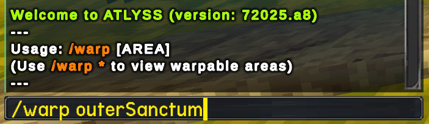
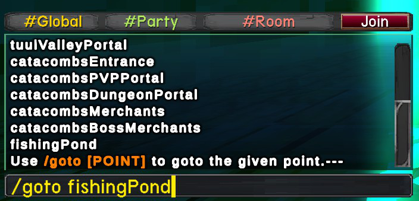



# Additional Fast Travel

A mod for Atlyss that gives the player additional fast travel options,
to warp to any point of interest in any area at any time.

# Features

- Allows you to teleport to any area and any point of interest
- Quick and easy usage with two chat commands
- Works in singleplayer and multiplayer

# Usage

This mod adds two extra chat commands the player can use to teleport themselves
to any point of interest in any publicly accessible area in the game.

This can be achieved by initially using the /warp command to teleport
to a given area, and then using the /goto command to move to a specific indicated location in the area.

### Using /warp

Using the /warp command will prompt the player to select an area name to warp to.
Using the warp command with a given area name will teleport the player to the
default spawn location of that area.

### Using /goto
Using the /goto command inside of a given area will list a selection of points
of interest for the area is currently in (Examples for the Sanctum hub area includes
the fishing lake, Sally's shop and the Outer Sanctum portal).

Using the /goto command with a given area of interest will move the player instantly
to the respective location in the current area.

## Limitations
To prevent abnormal behavior, it is not possible to either directly warp to any
dungeon instance in the game (Sanctum Catacombs, Crescent Grove), neither is it
possible to use the /warp and/or /goto commands while inside a dungeon instance.

You may still /goto to each dungeon's entrance portal, and you may still Recall
as normal out of a dungeon instance.

# Credits
Mod created by Clearwater

ATLYSS created by Kiseff

## Donations
If you enjoy my work, please consider donating! All received donations will go directly towards server hosting costs, which will allow me to keep the servers online for some of my other mods. Thank you!
  
